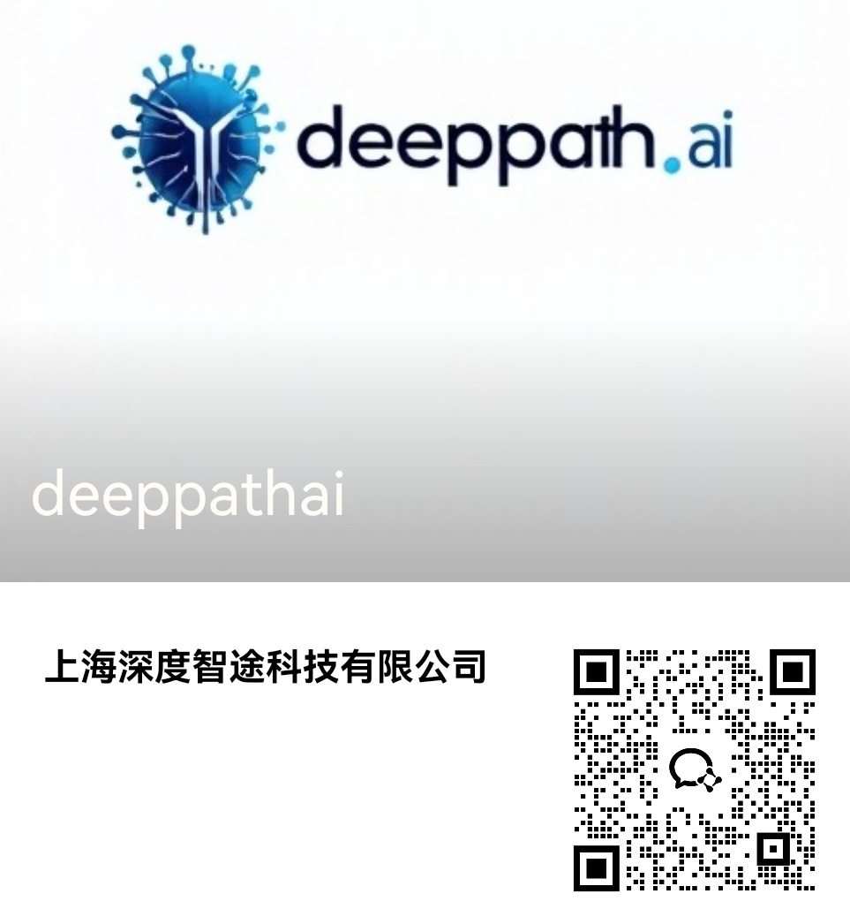

<div align="center">

# mcp-crew-risk

[](https://smithery.ai/server/@deeppath-ai/mcp-crew-risk)

</div> 


基于模型上下文协议（MCP）的爬虫风险评估师。
该服务器提供了一个简单的API接口，使用户能够针对指定网页做一个全面的爬虫合规风险评估体系评估。
<div>

# 爬虫合规风险评估体系说明

本体系旨在为爬虫开发者和运营者提供一套综合性的自动化合规检测工具，帮助评估目标网站的爬虫友好度及潜在风险，涵盖法律、社会伦理和技术三大维度。通过多层次风险提示和具体建议，辅助合理规划爬虫策略，避免法律纠纷和社会负面影响，同时提升技术稳定性和效率。

---

## 评估体系结构

### 1. 法律风险 (Legal Risk)

#### 检测内容
- 是否存在明确的服务条款（Terms of Service）声明限制爬虫行为
- 网站是否声明版权信息，内容是否受版权保护
- 页面中是否包含敏感个人数据（如邮箱、电话、身份证号等）

#### 风险意义
违反网站服务条款可能导致合同违约、侵权或刑事责任；抓取敏感数据可能违反 GDPR、CCPA 等隐私法规。

#### 检测示例
- 检测 `<meta>` 标签及页面内容关键字
- 邮箱、电话号码正则匹配

---

### 2. 社会伦理风险 (Social/Ethical Risk)

#### 检测内容
- robots.txt 文件中是否禁止爬虫访问特定路径
- 站点部署的反爬虫技术（如 Cloudflare JS Challenge）
- 涉及用户隐私或敏感信息的收集风险

#### 风险意义
过度抓取可能破坏用户体验和信任，采集个人隐私信息存在伦理风险，违反社会责任。

#### 检测示例
- robots.txt 访问及解析
- 检测反爬机制及JS挑战
- 敏感信息提取提示

---

### 3. 技术风险 (Technical Risk)

#### 检测内容
- 访问过程中是否遇到重定向、验证码、JS渲染障碍
- 是否能成功访问 robots.txt 以获取爬虫规则
- 目标 API 路径的暴露情况，可能存在权限或限流限制

#### 风险意义
技术层面风险可能导致爬虫失败、IP被封禁或数据不完整，影响业务稳定性。

#### 检测示例
- HTTP 状态码及响应头分析
- 反爬技术检测
- API路径扫描

---

## 评分体系

- **allowed（允许）**：无明显限制和风险，基本可安全爬取
- **partial（部分限制）**：存在部分限制（如robots.txt禁止部分路径、反爬措施），需谨慎操作
- **blocked（禁止）**：严重限制或高风险（如大量反爬JS挑战、敏感数据保护），不建议抓取

---

## 使用建议

| 风险维度 | 建议摘要 |
| -------- | -------- |
| 法律风险 | 认真阅读并遵守目标网站的服务条款，避免爬取敏感或个人隐私数据，必要时咨询法律顾问。 |
| 社会伦理风险 | 控制爬取频率，避免对网站服务器和用户体验造成影响，透明公开数据来源和用途。 |
| 技术风险 | 采用合适的爬虫框架和策略，支持动态渲染和反爬绕过，及时处理异常和监控访问健康。 |

---

## 实施流程

1. **预爬取检测**  
   先对目标站点运行合规评估，确认风险级别及限制。

2. **合规策略制定**  
   根据检测结果调整爬虫访问频率、抓取内容范围，避免违约或违法。

3. **爬虫执行与监控**  
   运行爬虫过程中持续监测技术异常及风险变化，定期重新评估。

4. **数据处理与保护**  
   确保抓取数据符合隐私保护要求，进行必要的匿名化处理。

---

## 技术实现简述

- 使用 Axios + node-fetch 进行 HTTP 请求，支持超时和重定向控制。
- 解析 `robots.txt` 及页面 `meta` 标签，自动识别爬虫规则。
- 利用正则表达式识别隐私敏感信息（邮箱、电话、身份证号等）。
- 检测反爬虫技术（如 Cloudflare JS Challenge）和 API 端点暴露情况。
- 通过风险判断函数分别给出法律、社会、技术风险提示及综合建议。

---

## 未来扩展

- 集成 Puppeteer/Playwright 支持 JavaScript 渲染页面检测。
- 自动化解析并提醒服务条款文本更新。
- 增加针对GDPR、CCPA等地区性法律的专项检测模块。
- 联合机器学习模型提升隐私敏感数据识别准确度。
- 提供 Web UI 展示合规检测报告和风险建议。

---

## 总结

本合规风险评估体系为爬虫开发和运营提供了基础且全面的风险判断框架，帮助团队在遵守法律法规与伦理原则前提下，提升技术效率和数据质量，降低潜在法律和社会风险。

</div>


<h1>✅ 1. 技术层面检查</h1>

| 检查项                    | 描述                                                         | 建议                               |
| ---------------------- | ---------------------------------------------------------- | -------------------------------- |
| `robots.txt` 是否存在      | 访问 `https://example.com/robots.txt`                        | 若存在，解析并严格遵守规则                    |
| `robots.txt` 中是否允许爬该路径 | 检查对指定 User-Agent 的规则（如 `Disallow`, `Allow`）                | 设定合适的 `User-Agent` 进行匹配          |
| meta robots 标签         | 页面中是否存在 `<meta name="robots" content="noindex, nofollow">` | 若存在，避免抓取/索引页面内容                  |
| X-Robots-Tag 响应头       | 响应头中是否含有 `X-Robots-Tag`（例如：`noindex`）                      | 遵循相应指令                           |
| 动态渲染内容                 | 页面是否依赖 JS 加载内容（如 React/Vue）                                | 可能需要使用 headless 浏览器（如 Puppeteer） |
| IP 限速 / WAF            | 是否存在访问频率限制、IP 封锁、验证码等                                      | 实现限速、重试、代理池                      |
| 反爬机制识别                 | 检查是否有 token 校验、Referer 检查、JS 混淆等                           | 可用网络分析工具排查                       |
| 是否支持 API 获取            | 页面数据是否也通过公开 API 提供                                         | 若有 API，优先使用，效率更高                 |


<h1>2. 法律与道德层面</h1>

| 检查项                       | 描述                                | 建议               |
| ------------------------- | --------------------------------- | ---------------- |
| 是否有用户协议（Terms of Service） | 查看 ToS 中是否禁止自动化抓取行为               | 若明确禁止，不应抓取       |
| 网站是否拥有版权声明                | 页面底部是否声明内容版权                      | 避免抓取有版权的数据用于商业用途 |
| 网站是否公开数据开放政策              | 有些网站提供 Open Data / 数据使用授权         | 遵守授权协议或开源许可      |
| 是否曾因爬虫行为被诉讼               | 一些网站（如 LinkedIn、Facebook）对爬虫持强硬立场 | 若有前例，风险更高，应避免    |

<h1>3. 数据保护与隐私</h1>

| 检查项                       | 描述                  | 建议                 |
| ------------------------- | ------------------- | ------------------ |
| 页面是否包含用户生成内容              | 比如评论、头像、电话、邮件、位置等   | 抓取这些内容可能违反隐私法规     |
| 是否有用户隐私政策（Privacy Policy） | 检查数据使用边界和限制         | 应遵循政策中关于数据处理的条款    |
| 是否涉及欧盟或加州用户               | 受 GDPR 或 CCPA 管控的数据 | 不能保存、分析个人数据，或需获得同意 |
| 是否抓取了可识别用户的信息             | 如手机号、身份证、邮箱、IP      | 非必要情况建议过滤/脱敏       |
| 是否抓取敏感领域信息                | 医疗、金融、未成年人等         | 需极高合规性，建议避免或匿名处理   |


<h1>4. 实际操作建议（合规友好策略）</h1>

| 检查项                       | 描述                                                 | 建议             |
| ------------------------- | -------------------------------------------------- | -------------- |
| 设置合理 `User-Agent`         | 明确说明工具来源，如 `MyCrawlerBot/1.0 (+email@example.com)` | 提高可信度，便于站点识别   |
| 设置访问频率限制                  | 避免过快访问（如 1\~2 次/秒）                                 | 减轻目标服务器负担，防止被封 |
| 添加 `Referer` 和 `Accept` 头 | 模拟正常浏览器行为                                          | 防止反爬拦截         |
| 支持失败重试机制                  | 应对 503、429、断线等异常                                   | 提高鲁棒性          |
| 日志记录与抓取时间控制               | 保存抓取日志，设置夜间爬取                                      | 可配合站点维护时间段调整频率 |
| 抓取数据注明来源                  | 数据用于展示或研究时建议注明来源                                   | 避免版权纠纷         |
| 数据储存匿名化、脱敏                | 特别是包含个人信息的内容                                       | 避免触犯隐私法律       |


##  🧠 一句话总结：

没有 robots.txt ≠ 可以任意抓；技术可以爬 ≠ 法律允许爬；尊重数据、尊重网站、尊重用户，才是合规爬虫的基础。

<h1 align="center">
🚩Features
</h1>

## 网站爬虫合规风险评估MCP ，主要实现功能包括：

---

## 1. 目标网站访问与基础状态检测 ✅ 已完成

- 访问目标网站首页，支持超时和最多5次重定向
- 返回 HTTP 状态码，判断网站是否正常访问
- 检测访问是否被重定向，提示潜在风险

---

## 2. 反爬虫机制检测  ✅ 已完成

- 判断服务器是否使用了 Cloudflare 等反爬保护
- 检测页面中是否存在 JavaScript 验证挑战（如 Cloudflare JS Challenge）
- 解析页面 `<meta name="robots">` 标签及 HTTP 响应头 `X-Robots-Tag`
- 自动请求并解析 `robots.txt` 文件，提取允许和禁止抓取路径

---

## 3. 敏感内容检测与法律风险提示 ✅ 已完成

- 检测页面中是否包含版权声明、服务条款（Terms of Service）相关信息
- 通过正则匹配识别页面中可能的个人隐私信息（邮箱、电话、身份证号等）
- 根据检测内容提示法律合规风险，防止侵权和隐私泄露

---

## 4. 公开 API 端点检测 ✅ 已完成
 
- 访问常见的 API 路径（如 `/api/`, `/v1/`, `/rest/` 等）
- 判断这些接口是否开放且可能需要鉴权，提示可能存在的权限和限制风险

---

## 5. 综合风险评估与分级 ✅ 已完成

- 根据所有检测结果，对爬虫可执行性进行三档评分：
  - `allowed`（允许）：无明显限制和风险
  - `partial`（部分限制）：存在部分技术或合规限制
  - `blocked`（禁止）：有明显反爬或

## 6. 待定功能  🚧 待定


<h1 align="center">⚙️Installation</h1>

### Installing via Smithery

To install mcp-crew-risk for Claude Desktop automatically via [Smithery](https://smithery.ai/server/@deeppath-ai/mcp-crew-risk):

```bash
npx -y @smithery/cli install @deeppath-ai/mcp-crew-risk --client claude
```

~~~bash
git clone https://github.com/Joooook/mcp-crew-risk.git
npm i
~~~


## <div align="center">▶️Quick Start</div>

### CLI
~~~bash
npx -y mcp-crew-risk
~~~

### MCP sever configuration

~~~json
{
    "mcpServers": {
        "mcp-crew-risk": {
            "command": "npx",
            "args": [
                "-y",
                "mcp-crew-risk"
            ]
        }
    }
}
~~~


## <div align="center">💭Murmurs</div>
本项目仅用于学习，欢迎催更。

<div align="center"><h1>联系方式</h1></div>
  
  
  ## 商务合作联系邮件：  [deeppathai@outlook.com](mailto:deeppathai@outlook.com)

</div>
